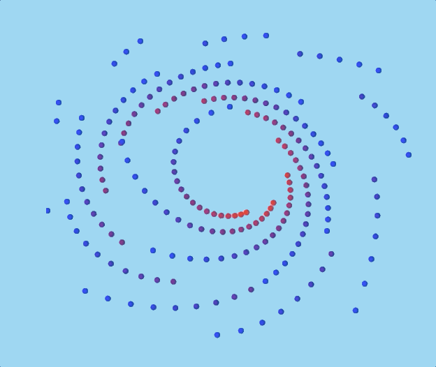

# Bezier playground

Playground for demonstrating how bezier lines look like.

### Run

`parcel` must be installed in global.

To install parcel

```sh
yarn global add parcel
# or
npm install -g parcel
```

```sh
yarn start
# or
npm start
```

#